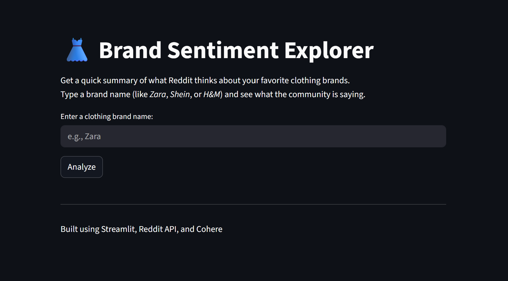
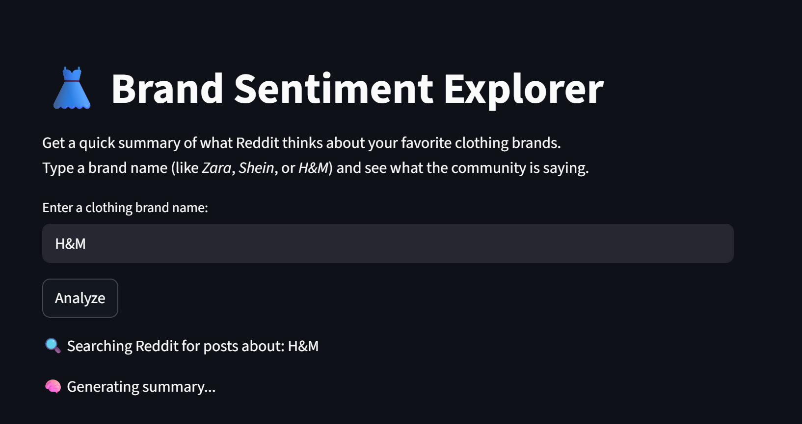
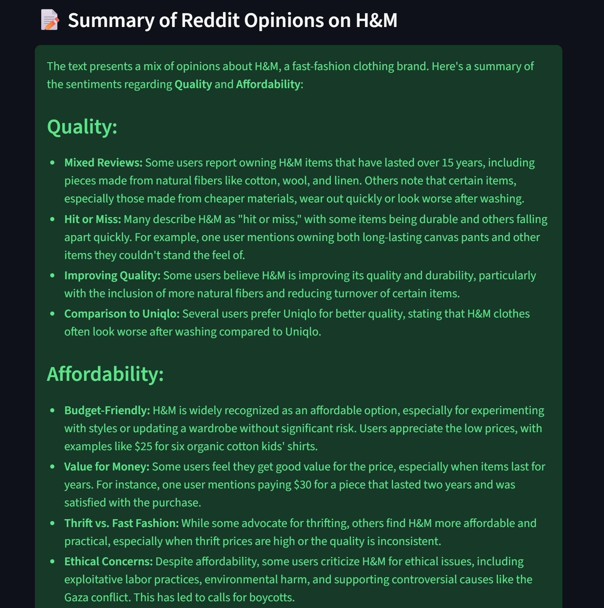
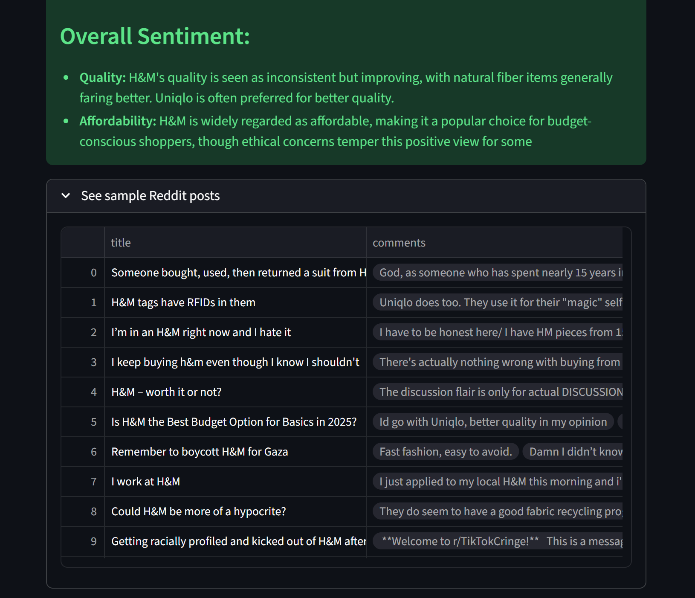

# -*- coding: utf-8 -*-
"""
Created on Sun Oct 19 11:24:58 2025

@author: Ivano
"""
# 👗 Brand Sentiment Explorer



### 🧠 Overview
Reddit has almost **2 billion monthly visitors**, and about **90 percent** are lurkers — users who mostly read other people’s comments without posting.  
However, scrolling through dozens of posts to find relevant opinions about a brand can be **time-consuming**.  

**Brand Sentiment Explorer** simplifies this process by automatically summarizing Reddit discussions about clothing brands.  
It analyzes the **latest 20 Reddit posts** mentioning a brand and organizes the insights into two clear categories:
- 🪡 **Quality**
- 💰 **Affordability**

---

### 🚀 How It Works

1. **Enter a Brand Name**  
   On the home page, type any clothing brand (for example: `Zara`, `H&M`, `Shein`) and press the **Analyze** button.  

   

2. **Processing**  
   The app searches Reddit for posts related to your brand and displays progress messages like:  
   - “🔍 Searching Reddit for posts about H&M”  
   - “🧠 Generating summary...”  

   

3. **View the Results**  
   Once analysis is complete, the summary is shown with key insights divided into **Quality** and **Affordability** sections.

   

4. **Explore Reddit Posts**  
   You can expand the results section to view a table of the analyzed Reddit posts and selected comments.

   

---

### ⚙️ Technologies Used
- **[Streamlit](https://streamlit.io/)** — for building the web interface  
- **[PRAW (Python Reddit API Wrapper)](https://praw.readthedocs.io/)** — for collecting Reddit posts and comments  
- **[Cohere API](https://cohere.ai/)** — for natural-language summarization  
- **Pandas** — for data structuring and display

---

### 💡 How to Run Locally
1. Clone the repository:  
   ```bash
   git clone https://github.com/Ouambo-SIM/brand-sentiment-Webapp.git
   cd brand-sentiment-Webapp

